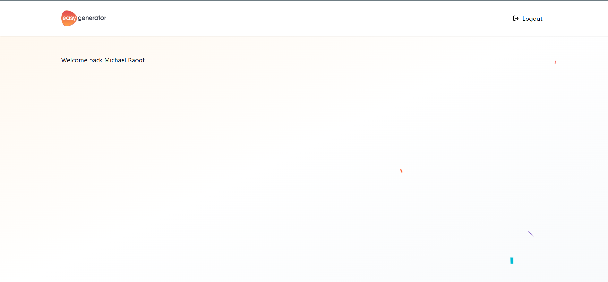
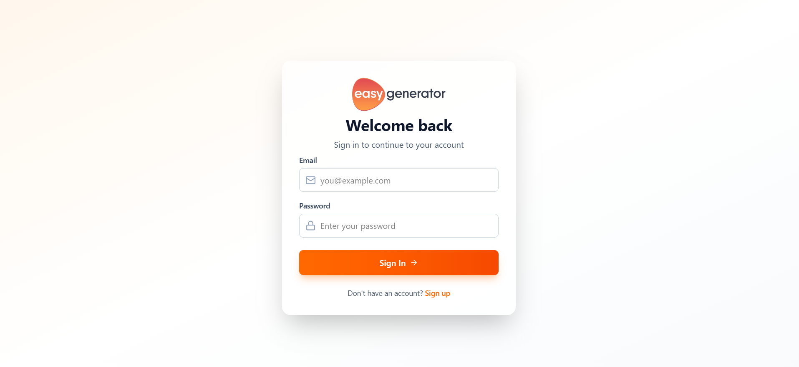
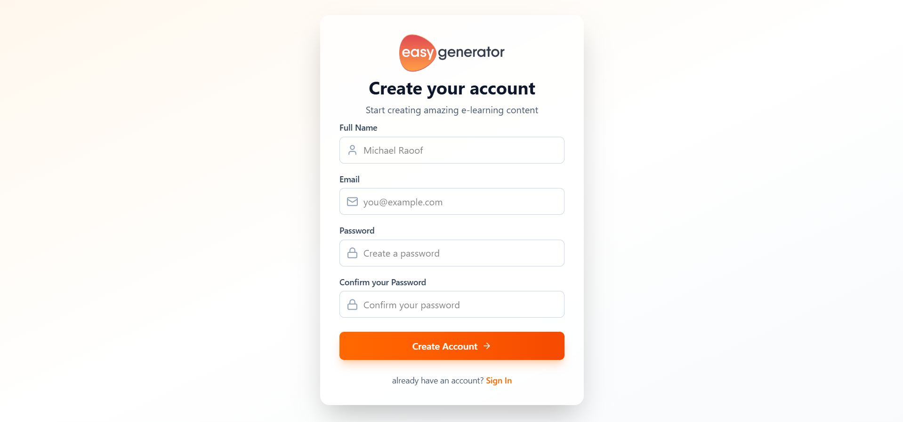

# EasyGenerator

this is a module that allows a user to sign up and sign in to the application. The application should be
production-ready and adhere to industry best practices for both front-end and back-end development.

- Backend: NestJS
- Frontend: React + Vite
- Auth: JWT
- API Docs: Swagger

  Front End Deployment: https://easygenerator-fe-michael.vercel.app/

## Screenshots

Home


Sign In


Sign Up


## Quick Start

1. Backend

```bash
cd backend
npm install
npm run start:dev
```

2. Frontend

```bash
cd frontend
npm install
npm run dev
```

- App: http://localhost:5173
- API: http://localhost:3000/api/v1
- Swagger UI: http://localhost:3000/api

## Environment

Create `backend/.env` (example):
